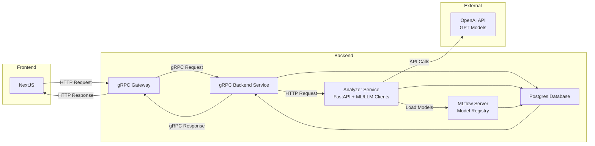

# Lotus

Practice Repo to host a full stack Journal Application with ML & LLM-powered topic classification and sentiment analysis.

It allows users to create, read, update, and delete journal entries, which are then analyzed and enriched with topics and sentiment scores using machine learning models and LLMs.

## Running the App

To run the app, run `make up` to spin up all resources. All applications run in Docker containers w/ hot-reloading enabled for dev across the stack.

When finished, run `make down`.

**Service URLs:**

- Frontend: http://localhost:3000
- Backend API Gateway: http://localhost:8080
- Backend gRPC: http://localhost:50051
- Analyzer Service: http://localhost:8083
- MLFlow UI: http://localhost:5000
- Dagster: http://localhost:3001
- PostgreSQL: http://localhost:5432

## Architecture

**Services:**

- **Next.js Frontend** - User-facing web application for journal entry management
- **Go Core Backend Service** - gRPC server with HTTP gateway for CRUD operations and core application logic throughout the app
- **Python Analyzer Service** - FastAPI server that connects to MLFlow to serve ML models for journal topic classification and sentiment analysis
- **PostgreSQL Database** - Primary database for journal entries and user data
- **MLFlow Server** - Model registry and experiment tracking for ML workflows

### Data Architecture

**Services:**

- **dbt** - Data transformation and modeling tool to structure and prepare data for analysis and reporting
- **Dagster** - Orchestration tool to manage and schedule data workflows and pipelines
  - Preferred over Airflow for modern features and better integration with dbt
- **Airflow** - Legacy orchestration tool for managing data workflows
