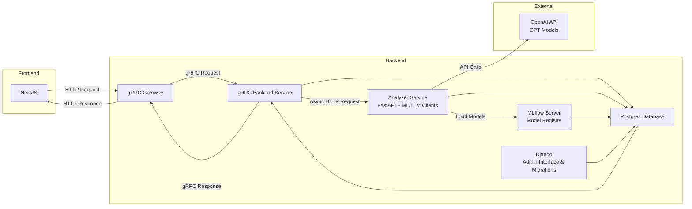

# Lotus

Monorepo to host a full stack Journal Application with ML & LLM-powered topic classification and sentiment analysis.

It allows users to create, read, update, and delete journal entries, which are then analyzed and enriched with topics and sentiment scores using machine learning models and LLMs.

The project is mainly designed as a learning exercise to explore full stack development, microservices architecture, monorepo management,
and getting exposure to ML Ops concepts.

## Structure

The monorepo is organized into three main directories:

- `docker/` - Contains Docker Compose configuration files and database bootstrap scripts for local development
- `services/` - Contains all application services, each with their own:
  - Source code and application logic
  - Dockerfile(s) for containerization
  - Configuration files (e.g., `pyproject.toml`, `go.mod`, `package.json`)
  - Tests and documentation
  - Service-specific dependencies and build configurations
- `.github/workflows` - Contains CI/CD workflow files, with each service having its own dedicated workflow file for automated testing (and in a future state - build & deployment)

**Service URLs:**

- Frontend: http://localhost:3000
- Backend REST API Gateway: http://localhost:8080
- Backend gRPC Service: http://localhost:50051
- Analyzer REST API Service: http://localhost:8083
- Django Admin: http://localhost:8000/admin/
- MLFlow UI: http://localhost:5000
- Dagster UI: http://localhost:3001
- Tilt UI: http://localhost:10350 (when using `make tilt-up`)
- PostgreSQL: localhost:5432
- Redis: localhost:6379
- Redis Insight: http://localhost:5540
  - Database Connection: `redis://redis:6379/0`


## Running the App

### Tilt (Recommended for Local Development)

[Tilt](https://tilt.dev/) was added to provide faster rebuilds, better caching, and a unified UI for managing all services during development compared to Docker Compose. It runs 24/7 in the background, watching for file changes and automatically rebuilding/restarting services as needed.

- It reads from `tilt_config.yaml` to determine which services to enable/disable, and updates in real-time as the file is modified.

**Quick Start:**
```bash
# Install Tilt (if not already installed)
# macOS: brew install tilt-dev/tap/tilt
# Linux: curl -fsSL https://raw.githubusercontent.com/tilt-dev/tilt/master/scripts/install.sh | bash

# Start Tilt
make up
```

**Features:**
- **Faster rebuilds**: Smart caching - only rebuilds when dependencies change
- **Service management**: Enable/disable services via `tilt_config.yaml`
- **Unified UI**: Monitor all services at http://localhost:10350
- **Auto-reload**: Tilt watches `tilt_config.yaml` and automatically adjusts services

### Docker Compose (CI / Fallback)

Docker Compose is still available for CI/CD pipelines and as a fallback option. The `docker-compose-local.yaml` file is used by GitHub Actions workflows.

**Commands:**
```bash
make up      # Start all services
make down    # Stop all services
```

**Note:** For local development, Tilt is recommended for better performance and developer experience.

## Architecture



**Services:**

- **Next.js Frontend** - User-facing web application for journal entry management
- **Go Core Backend Service** - gRPC server with HTTP gateway for CRUD operations and core application logic throughout the app
- **Python Analyzer Service** - FastAPI server connecting to MLflow and LLM APIs to asynchronously enrich journal entries with topic classification and sentiment analysis after user actions.
- **Django Admin** - Database schema migration tool and internal admin interface for managing feature flags and application data
- **PostgreSQL Database** - Primary database for journal entries and user data
- **MLFlow Server** - Model registry and experiment tracking for ML workflows within the `experiments/` directory

### Data Architecture

**Services:**

- **dbt** - Data transformation and modeling tool to structure and prepare data for analysis and reporting
- **Dagster** - Orchestration tool to manage and schedule data workflows and pipelines
  - Preferred over Airflow for modern features and better integration with dbt
- **Airflow** - Legacy orchestration tool for managing data workflows
