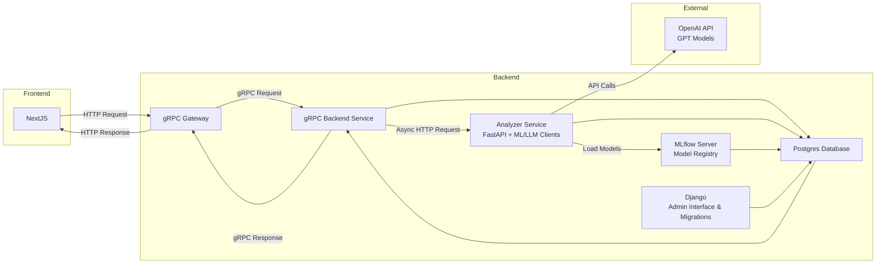

# Lotus

Monorepo to host a full stack Journal Application with ML & LLM-powered topic classification and sentiment analysis.

It allows users to create, read, update, and delete journal entries, which are then analyzed and enriched with topics and sentiment scores using machine learning models and LLMs.

The project is mainly designed as a learning exercise to explore full stack development, microservices architecture, monorepo management,
and getting exposure to ML Ops concepts.

## Structure

The monorepo is organized into three main directories:

- `docker/` - Contains Docker Compose configuration files and database bootstrap scripts for local development
- `services/` - Contains all application services, each with their own:
  - Source code and application logic
  - Dockerfile(s) for containerization
  - Configuration files (e.g., `pyproject.toml`, `go.mod`, `package.json`)
  - Tests and documentation
  - Service-specific dependencies and build configurations
- `.github/workflows` - Contains CI/CD workflow files, with each service having its own dedicated workflow file for automated testing (and in a future state - build & deployment)

**Application Services:**

| Service                  | URL                          |
| ------------------------ | ---------------------------- |
| Frontend                 | http://localhost:3000        |
| Backend REST API Gateway | http://localhost:8080        |
| Backend gRPC             | http://localhost:50051       |
| Analyzer REST API        | http://localhost:8083        |
| Django Admin             | http://localhost:8000/admin/ |
| Tilt UI                  | http://localhost:10350       |

**Data Services:**

| Service    | URL                   |
| ---------- | --------------------- |
| MLflow UI  | http://localhost:5000 |
| Dagster UI | http://localhost:3001 |

**Infrastructure & Observability:**

| Service       | URL / Connection                                           | Purpose                                                                             |
| ------------- | ---------------------------------------------------------- | ----------------------------------------------------------------------------------- |
| PostgreSQL    | `localhost:5432`                                           | Primary database                                                                    |
| Redis         | `localhost:6379`                                           | Caching                                                                             |
| Redis Insight | http://localhost:5540 (connection: `redis://redis:6379/0`) | Redis UI                                                                            |
| Jaeger        | http://localhost:16686                                     | Distributed traces (backend, frontend, analyzer)                                    |
| Prometheus    | http://localhost:9090                                      | Metrics scraping (backend `/metrics`, frontend `/api/metrics`, analyzer `/metrics`) |
| Grafana       | http://localhost:3002                                      | Dashboards — login: `admin` / `admin`                                               |

## Running the App

### Tilt

[Tilt](https://tilt.dev/) is used for local development to manage building and running all services. It serves as an alternative to Docker Compose with faster rebuilds, smarter caching, and a unified UI for all logs. Tilt runs in the background watching for file changes and automatically rebuilding/restarting services as needed.


#### Quick Start

Install Tilt [here](https://docs.tilt.dev/install.html) and run:

```bash
make up
```

This will start all enabled services as defined in `tilt_config.yaml`. Access the Tilt UI at http://localhost:10350 to monitor builds and logs.

When finished, run:

```bash
make down
```

#### Configuration

Tilt reads from `tilt_config.yaml` to determine which services to run. Changes to this file are picked up automatically without restarting Tilt.

```yaml
services:
  enabled:
    frontend: true
    backend: true
    analyzer: false # disable services you're not working on
    django_admin: true
    dagster: false
```

#### Why Tilt over Docker Compose?

| Feature            | Docker Compose                                | Tilt                                   |
| ------------------ | --------------------------------------------- | -------------------------------------- |
| Rebuild on change  | Manual (`docker compose up --build`)          | Automatic                              |
| Dependency caching | Basic layer caching                           | Smart rebuilds (only when deps change) |
| Service logs       | Separate terminal or `docker compose logs -f` | Unified UI with filtering              |
| Selective services | Profiles (static)                             | Config file (dynamic, hot-reload)      |

## Architecture


```mermaid
graph LR
    A[NextJS] -->|HTTP Request| B[Go gRPC Gateway]
    B -->|gRPC Request| C[gRPC Backend Service]
    C --> D[Postgres Database]
    D --> C
    C -->|gRPC Response| B
    B -->|HTTP Response| A

    C -->|Async HTTP Request| E[Analyzer Service]
    E -->|Load Models| F[MLflow Server]
    E --> D
    F --> D
    E -->|API Calls| G[OpenAI API]

    H --> D

    subgraph Backend
        B[gRPC Gateway]
        C[gRPC Backend Service]
        D[Postgres Database]
        E[Analyzer Service<br/>FastAPI + ML/LLM Clients]
        F[MLflow Server<br/>Model Registry]
        H[Django<br/>Admin Interface & Migrations]
    end

    subgraph Frontend
        A
    end

    subgraph External
        G[OpenAI API<br/>GPT Models]
    end
```

**Services:**

- **Next.js Frontend** - User-facing web application for journal entry management
- **Go Core Backend Service** - gRPC server with HTTP gateway for CRUD operations and core application logic throughout the app
- **Python Analyzer Service** - FastAPI server connecting to MLflow and LLM APIs to asynchronously enrich journal entries with topic classification and sentiment analysis after user actions.
- **Django Admin** - Database schema migration tool and internal admin interface for managing feature flags and application data
- **PostgreSQL Database** - Primary database for journal entries and user data
- **MLFlow Server** - Model registry and experiment tracking for ML workflows within the `experiments/` directory

### Data Architecture

**Services:**

- **dbt** - Data transformation and modeling tool to structure and prepare data for analysis and reporting
- **Dagster** - Orchestration tool to manage and schedule data workflows and pipelines

## Testing

The project uses a multi-layered testing strategy to ensure correctness at every level, from individual functions to cross-service boundaries.

**Unit & Integration Tests** — Each service has its own unit and integration tests that run as part of its dedicated CI/CD workflow. These form the foundation of the test suite and catch the majority of bugs with fast feedback loops.

**Contract Tests** — Consumer-driven contract tests using [Pact](https://pact.io/) verify that services agree on the shape of data exchanged between them. Consumer services (frontend, backend) generate pact files defining their expectations, and provider services verify they satisfy those contracts. These run in a dedicated workflow triggered by changes to any service involved in a contract, or by adding the `contract-tests` label to a PR.

**End-to-End Tests** — Playwright-based E2E tests run against the frontend and verify complete user flows across the full stack (Docker Compose). On GitHub Actions, the dedicated **E2E** workflow (`.github/workflows/e2e.yaml`) runs on pull requests when changes land under `services/backend/`, `services/frontend/`, `services/analyzer/`, `services/django/`, or `docker/`.

**Load Tests** — [k6](https://k6.io/) load tests target the backend service to validate performance characteristics and ensure the system holds up under concurrent usage.

## CI / CD

Each service has a dedicated GitHub Actions workflow file in `.github/workflows/`. Workflows are path-scoped so they only trigger when relevant files change, keeping CI fast and focused.

Workflows trigger in two scenarios: on pull requests for pre-merge validation, and on pushes to `main` (i.e. after a PR merge) to verify the post-merge state. Each workflow includes its own workflow file in the path filter so changes to the pipeline itself are also validated. The E2E workflow is pull-request only and uses the path filters described in the Testing section above.

Sparse checkout is used to only clone the files each workflow needs rather than the full monorepo, reducing checkout time and keeping jobs lean.

For services that require integration dependencies like PostgreSQL or MLflow, Docker Compose is used via Makefile targets (e.g. `make ci-analyzer-up`) to spin up supporting infrastructure before tests run.
