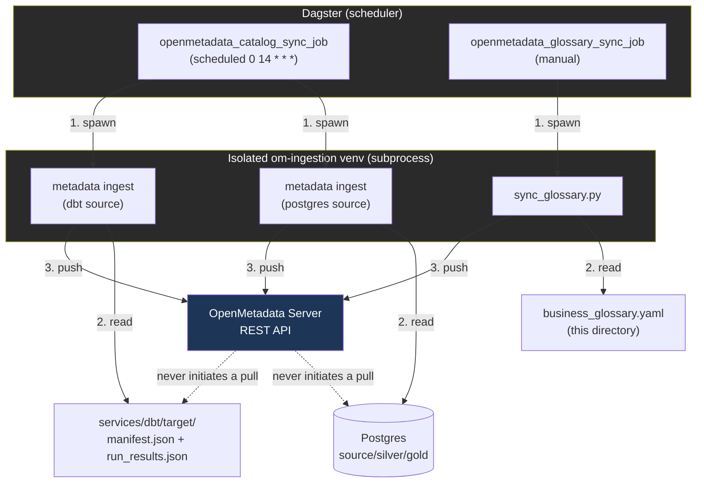

# OpenMetadata integration

This package is the Dagster-side home for everything that talks to OpenMetadata (the data catalog). There's no Airflow in this repo, so Dagster itself is the scheduler that runs OpenMetadata's own ingestion SDK — Dagster orchestrates, OpenMetadata stays a passive REST API receiver. See `dagster_project/resources/openmetadata.py` for the resource both jobs below share, and `services/dagster/om_ingestion/` for the isolated venv this all runs in (the `openmetadata-ingestion` package can't share the main project's venv — its `collate-sqllineage` dependency pins a `sqlglot` version that conflicts with `dagster-dbt`'s, and it doesn't support this project's Python version either).

## The two jobs

### `openmetadata_catalog_sync_job` — technical lineage (scheduled, `0 14 * * *`)

Defined in `defs/jobs/openmetadata_catalog_sync_job.py`, built from two assets in `defs/assets/catalog/openmetadata_sync.py`:

1. **`openmetadata_postgres_sync`** — ingests the `source`/`silver`/`gold` schemas as an OpenMetadata Database Service (`lotus_postgres`). This has to run first: OpenMetadata's dbt connector attaches lineage onto _existing_ table entities, it doesn't create tables from dbt alone.
2. **`openmetadata_dbt_sync`** — parses `services/dbt/target/manifest.json` + `run_results.json` and attaches lineage, descriptions, and test results onto the tables the postgres sync created.

Both use `OpenMetadataResource.run_ingestion()`, which writes an OpenMetadata ingestion-workflow YAML config to a temp file and runs `metadata ingest -c <file>` in the isolated venv.

Runs daily, after the other dbt builds (`0 6 * * *` and `0 12 * * *`), since the dbt sync reads whatever the latest `manifest.json`/`run_results.json` happen to be — it isn't tied to any single per-source pipeline.

### `openmetadata_glossary_sync_job` — glossary as code (manual, no schedule)

Defined in `defs/jobs/openmetadata_glossary_sync_job.py`, one asset in `defs/assets/catalog/openmetadata_glossary_sync.py`. Reads `business_glossary.yaml` (in this directory) and calls `Glossaries.create()` / `GlossaryTerms.create()` via OpenMetadata's `metadata.sdk` facade classes — both are upserts, so re-running after an edit is always safe. Uses `OpenMetadataResource.run_script()`, which runs `sync_glossary.py` directly in the isolated venv instead of going through the `metadata ingest` CLI.

No schedule on purpose: glossary content is driven by git commits, not a clock. Edit the YAML, commit, then run the job — the same "edit the file, apply the change" model as any infra-as-code tool.

**Caveat**: it's upsert-only. Deleting a term from the YAML and re-running does _not_ delete it from OpenMetadata — that still needs a manual step in the console. There's no diff/prune logic here (yet).

This same pattern (YAML in git → small script → `run_script()`) extends cleanly to Domains and Data Products, since `metadata.sdk` exposes the same facade shape for those too.

## It's push-based, not pull-based

OpenMetadata never reaches out to Postgres, dbt, or this repo on its own — `PIPELINE_SERVICE_CLIENT_ENABLED=false` in its docker-compose config disables that path entirely (it's normally how OpenMetadata's bundled Airflow would trigger ingestion, which this repo doesn't run). Instead, Dagster is the thing that runs _extract + push_: it reads the source (Postgres schema, dbt artifacts, or the glossary YAML) and pushes the result to OpenMetadata's REST API. OpenMetadata's job is to store what it's given and serve it back through the UI/API — it's a receiver, not an initiator.

## Adding a glossary term

1. Edit `business_glossary.yaml` (or add a new glossary block, if you want a second one — `sync_glossary.py` currently syncs a single file passed via `--config`, so a second glossary would need its own asset/job pointed at its own file, or the script extended to take a directory).
2. Commit.
3. Run `openmetadata_glossary_sync_job` from the Dagster UI.
