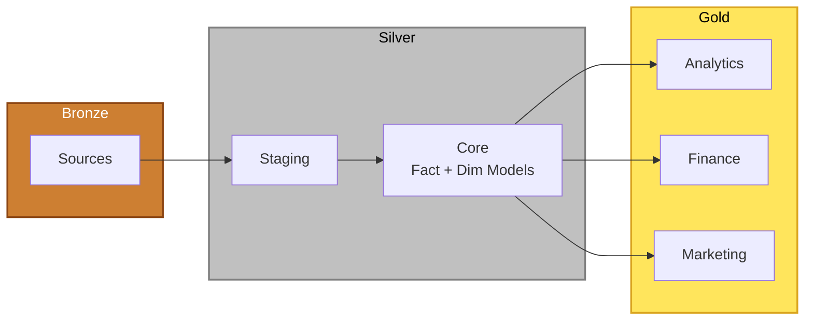

# Analytics dbt Project

This dbt project transforms raw application data into analytics-ready datasets following a medallion architecture pattern.

## Project Structure

```
models/
├── sources/              # Bronze layer - source definitions
│   └── application_db/   # Raw tables from application database
│
├── silver/               # Silver layer - cleaned and transformed data
│   ├── staging/          # Staging tables (deduplication, renaming)
│   └── core/             # Fact and dimension tables
│
└── gold/                 # Gold layer - mart-ready analytics datasets
    └── analytics/        # Business-ready analytical models
```

## Data Flow

### Bronze -> Silver -> Gold



**Bronze (Sources)**

- Defined in `models/sources/application_db/`
- References raw tables from the `source` schema in the application database
- Tables: `users`, `journals`, `journal_details`, `journal_sentiments`, `journal_topics`

**Silver Layer**

1. **Staging** (`models/silver/staging/`)
   - Incremental models that deduplicate and standardize data from sources
   - Renames columns for consistency (e.g., `id` -> `user_id`)
   - Filters and cleans raw data
   - Materialized as incremental tables
   - Schema: `silver`
   - Examples: `stg_users`, `stg_journals`, `stg_journal_details`

2. **Core** (`models/silver/core/`)
   - Fact tables (`fct_*`): Transactional/event data
     - `fct_journal_entries`: Journal entries with sentiment and details
     - `fct_journal_topics`: Journal topic associations
   - Dimension tables (`dim_*`): Descriptive reference data
     - `dim_users`: User attributes and metadata
   - Built from staging tables with business logic applied
   - Schema: `silver`

**Gold Layer** (`models/gold/`)

- Mart-ready datasets optimized for analytics and reporting
- Aggregated metrics and business KPIs
- Materialized as tables for fast query performance
- Schema: `gold`
- Organized by business domain:
  - `analytics/`: Analytics and reporting marts (e.g., `user_journal_summary`)
  - `finance/`: Financial reporting marts
  - `marketing/`: Marketing analytics marts

## Groups

Groups are defined in `models/_groups.yml` and are used for **labeling models in Dagster**. They help organize and categorize dbt models for better visibility and management in the Dagster UI.

Available groups:

- `bronze`: Source definitions
- `staging`: Staging models
- `core`: Fact and dimension models
- `analytics`: Gold layer analytics models
- `product`: Product-specific models

Groups are assigned to models via the `+group` config in `dbt_project.yml` or individual model configs.
